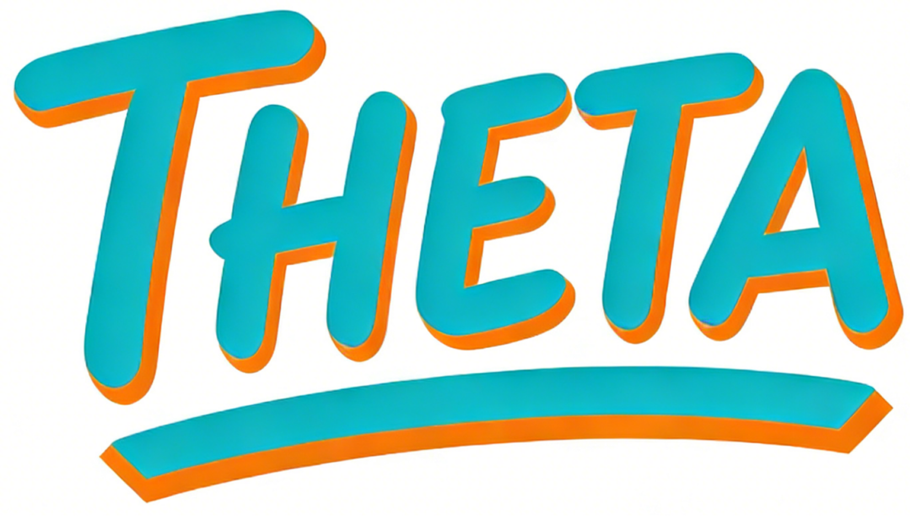

<div align="center">



<h1>THETA (θ)</h1>

[](https://theta.code-soul.com/)
[](https://huggingface.co/CodeSoulco/THETA)
[](https://arxiv.org/abs/2603.05972)

[English](README.md) | **中文**

**THETA (θ) 是一个面向社会科学研究的低门槛、高性能大模型增强主题分析平台。**

</div>

---

## 目录

1. [快速上手：五分钟环境就绪](#快速上手五分钟环境就绪)
2. [数据格式要求](#数据格式要求)
3. [配置系统：从硬件到实验](#配置系统从硬件到实验)
4. [运行模式：小白 vs 专家](#运行模式小白-vs-专家)
5. [产物地图：结果在哪？](#产物地图结果在哪)
6. [科学评估标准](#科学评估标准)
7. [支持的模型](#支持的模型)
8. [训练参数参考](#训练参数参考)
9. [常见问题](#常见问题)

---

## 快速上手：五分钟环境就绪

### 步骤 1：克隆仓库

```bash
git clone https://github.com/CodeSoul-co/THETA.git
cd THETA
```

### 步骤 2：环境隔离 (Conda)

```bash
conda create -n theta python=3.10 -y
conda activate theta
```

### 步骤 3：安装系统编译工具（BTM 模型需要）

```bash
apt-get update
apt-get install -y autoconf automake libtool build-essential
```

### 步骤 4：安装 Python 依赖

```bash
# 先安装 bitermplus（需要从源码编译）
pip install git+https://github.com/maximtrp/bitermplus.git

# 安装其余所有依赖
pip install -r src/models/requirements.txt
```

### 步骤 5：配置环境变量

```bash
# 复制配置模板
cp .env.example .env

# 编辑 .env 文件，配置模型路径
# 至少需要配置：QWEN_MODEL_0_6B 和 SBERT_MODEL_PATH
```

### 步骤 6：加载环境变量

```bash
# 如果遇到 "$'\r': command not found" 错误，先修复 Windows 换行符
sed -i 's/\r$//' scripts/env_setup.sh

# 加载环境变量到当前 shell（必须执行，确保后续脚本能读取配置）
source scripts/env_setup.sh
```

**模型下载地址**：

| 模型 | 用途 | 下载地址 |
|------|------|----------|
| **Qwen3-Embedding-0.6B** | THETA 文档嵌入 | [ModelScope](https://www.modelscope.cn/models/Qwen/Qwen3-Embedding-0.6B) |
| **all-MiniLM-L6-v2** | CTM/SBERT 嵌入 | [HuggingFace](https://huggingface.co/sentence-transformers/all-MiniLM-L6-v2) |

下载后放入 `models/` 目录：

```
models/
├── qwen3_embedding_0.6B/
└── sbert/sentence-transformers/all-MiniLM-L6-v2/
```

###  模型自动下载

THETA 支持在训练时**自动检测并下载**缺失的模型权重文件。

**自动下载**（推荐）：直接运行训练命令，系统会自动检测并下载缺失的模型：

```bash
# CTM/BERTopic 训练 - 自动下载 SBERT
bash scripts/train_baseline.sh ctm --dataset your_dataset --num_topics 20

# THETA 训练 - 自动下载 Qwen
bash scripts/train_theta.sh --dataset your_dataset --model_size 0.6B
```

> **注意**：首次运行时，模型下载可能需要几分钟时间。如果网络问题导致自动下载失败，请参考上方表格中的下载链接手动下载。

---

## 数据格式要求

THETA 使用**严格的列名规范**来处理数据文件。

### 列名规范

| 用途 | 列名 | 适用模型 | 格式 |
|------|------|---------|------|
| **文本** | `text` | 所有模型 | 字符串 |
| **时间戳** | `timestamp` | DTM | `2026`、`2026-10-17` 或 `2026-10-17 14:30:00` |
| **协变量** | `cov_*` | STM | 以 `cov_` 为前缀（如 `cov_province`） |
| **标签** | `label` | 有监督学习 | 字符串或整数 |

### 模型特定要求

| 模型 | 必需列 |
|------|--------|
| **DTM** | `text`, `timestamp` |
| **STM** | `text`, `cov_*` |

>  **DTM 注意**：仅支持**年份级别**的粒度。日期如 `2026-10-17` 会被转换为 `2026`。
> 
>  **STM 注意**：所有协变量列**必须**使用 `cov_` 前缀。

 **CSV 模板请参见 [example/DATA_FORMAT_TEMPLATE.zh.md](example/DATA_FORMAT_TEMPLATE.zh.md)**

---

## 配置系统：从硬件到实验

THETA 采用**分层配置**架构，让您从硬件路径到实验参数都能灵活控制。

### 核心配置文件 `.env`（硬件物理路径）

创建 `.env` 文件（参考 `.env.example`），配置**必填项**：

```bash
# zero_shot 默认：云端 embedding 服务
EMBEDDING_PROVIDER=cloud
EMBEDDING_CLOUD_PROVIDER=openai
OPENAI_API_KEY=your-openai-api-key
# 可选：EMBEDDING_MODEL=text-embedding-3-small

# supervised/unsupervised 需要 finetune，必须配置本地 Qwen 权重
# EMBEDDING_PROVIDER=local
# QWEN_MODEL_0_6B=./models/qwen3_embedding_0.6B

# 必填：SBERT 模型路径（CTM/BERTopic 需要）
SBERT_MODEL_PATH=./models/sbert/sentence-transformers/all-MiniLM-L6-v2

# 必填：数据和结果目录
DATA_DIR=./data
WORKSPACE_DIR=./data/workspace
RESULT_DIR=./result
```

### 实验参数 `config/default.yaml`（默认超参）

该文件存储了所有模型的默认训练参数：

```yaml
# 通用训练参数
training:
  epochs: 100
  batch_size: 64
  learning_rate: 0.002

# THETA 特有参数
theta:
  num_topics: 20
  hidden_dim: 512
  model_size: 0.6B

# 可视化设置
visualization:
  language: zh    # 中文可视化
  dpi: 150
```

### 优先级准则 (Priority Rule)

参数生效优先级：

```
命令行参数 (CLI)  >  YAML 默认值  >  代码保底值
```

例如：
- `--num_topics 50` 会覆盖 YAML 中的 `num_topics: 20`
- 如果 CLI 和 YAML 都未指定，则使用代码中的默认值

---

## 运行模式：小白 vs 专家

### 小白模式：一键自动化 (Bash Scripts)

只需准备好数据，脚本将自动完成**清洗 → 预处理 → 训练 → 评估 → 可视化**全流程：

```bash
# 一键训练（需指定语言参数）
bash scripts/quick_start.sh my_dataset --language chinese
bash scripts/quick_start.sh my_dataset --language english
```

**数据准备要求**：
- 将原始文档放入 `data/{dataset}/` 目录
- 支持格式：`.txt`、`.csv`、`.docx`、`.pdf`

### 专家模式：手术刀级调优 (Python CLI)

直接调用 Python 脚本，精确控制每个参数：

```bash
# 训练 LDA，覆盖默认参数
python src/models/run_pipeline.py \
    --dataset my_dataset \
    --models lda \
    --num_topics 50 \
    --learning_rate 0.01 \
    --language chinese

# 训练 THETA，使用 4B 模型
python src/models/run_pipeline.py \
    --dataset my_dataset \
    --models theta \
    --model_size 4B \
    --num_topics 30 \
    --epochs 200
```

**关键模块入口**：

| 模块 | 入口脚本 | 功能 |
|------|----------|------|
| 数据清洗 | `src/models/dataclean/main.py` | 文本清洗、分词、停用词去除 |
| 数据预处理 | `src/models/prepare_data.py` | 生成 BOW 矩阵和嵌入向量 |
| 模型训练 | `src/models/run_pipeline.py` | 训练、评估、可视化一体化 |

---

## 产物地图：结果在哪？

THETA 模型和基线模型的结果路径**不同**，请注意区分：

### THETA 模型结果

```
result/{dataset}/{model_size}/theta/exp_{timestamp}/
├── config.json                     # 实验配置
├── metrics.json                    # 7 大评估指标
├── data/                           # 预处理数据
│   ├── bow/                        # 词袋矩阵
│   │   ├── bow_matrix.npy
│   │   ├── vocab.txt
│   │   ├── vocab.json
│   │   └── vocab_embeddings.npy
│   └── embeddings/                 # Qwen 文档嵌入
│       ├── embeddings.npy
│       └── metadata.json
├── theta/                          # 模型参数（固定文件名，无时间戳）
│   ├── theta.npy                   # 文档-主题分布 (D × K)
│   ├── beta.npy                    # 主题-词分布 (K × V)
│   ├── topic_embeddings.npy        # 主题嵌入向量
│   ├── topic_words.json            # 主题词列表
│   ├── training_history.json       # 训练历史
│   └── etm_model.pt                # PyTorch 模型
└── {lang}/                         # 可视化输出 (zh 或 en)
    ├── global/                     # 全局图表
    │   ├── 主题表.csv
    │   ├── 主题网络图.png
    │   ├── 主题相似度.png
    │   ├── 主题词云.png
    │   ├── 7项核心指标图.png
    │   └── ...
    └── topic/                      # 主题详情
        ├── topic_1/
        │   └── 词重要性图.png
        └── ...
```

### 基线模型结果（LDA、CTM、BTM 等）

```
result/{dataset}/{user_id}/{model}/exp_{timestamp}/
├── config.json                     # 实验配置
├── metrics_k{K}.json               # 7 大评估指标
├── {model}/                        # 模型参数
│   ├── theta_k{K}.npy              # 文档-主题分布
│   ├── beta_k{K}.npy               # 主题-词分布
│   ├── model_k{K}.pkl              # 模型文件
│   └── topic_words_k{K}.json
├── {lang}/                         # 可视化目录 (zh 或 en)
│   ├── global/                     # 全局对比图
│   │   ├── 主题网络图.png
│   │   ├── 主题相似度图.png
│   │   └── ...
│   └── topic/                      # 主题详情
│       ├── topic_0/
│       │   ├── 词云图.png
│       │   └── 词分布图.png
│       └── ...
└── README.md                       # 实验摘要
```

### 路径说明

| 模型类型 | 结果路径 |
|----------|----------|
| THETA | `result/{dataset}/{model_size}/theta/exp_{timestamp}/` |
| 基线模型 | `result/{dataset}/{user_id}/{model}/exp_{timestamp}/` |

---

## 科学评估标准

THETA 强制执行 **7 大金标准指标**，确保所有模型（THETA 及 12 个基线）的评估对齐：

| 指标 | 全称 | 描述 | 理想值 |
|------|------|------|--------|
| **TD** | Topic Diversity | 主题多样性，衡量主题词的独特性 | ↑ 越高越好 |
| **iRBO** | Inverse Rank-Biased Overlap | 逆排名偏重重叠，衡量主题间差异 | ↑ 越高越好 |
| **NPMI** | Normalized PMI | 标准化点互信息，衡量主题词共现 | ↑ 越高越好 |
| **C_V** | C_V Coherence | 基于滑动窗口的一致性 | ↑ 越高越好 |
| **UMass** | UMass Coherence | 基于文档共现的一致性 | ↑ 越高越好（负值） |
| **Exclusivity** | Topic Exclusivity | 主题排他性，词是否专属于单一主题 | ↑ 越高越好 |
| **PPL** | Perplexity | 困惑度，模型拟合能力 | ↓ 越低越好 |

> **注意**：显著性 (Significance) 数据仅用于可视化，不纳入核心评估指标。

---

## 支持的模型

### 模型概览

| 模型 | 类型 | 描述 | 自动主题数 | 最佳适用场景 |
|------|------|------|------------|--------------|
| `theta` | 神经模型 | 使用 Qwen 嵌入的 THETA 模型 | 否 | 通用目的，高质量 |
| `lda` | 传统模型 | 潜在狄利克雷分配 | 否 | 快速基线，可解释性强 |
| `hdp` | 传统模型 | 层次狄利克雷过程 | **是** | 主题数量未知 |
| `stm` | 传统模型 | 结构主题模型 | 否 | **需要协变量** |
| `btm` | 传统模型 | 双词主题模型 | 否 | 短文本（推文、标题） |
| `etm` | 神经模型 | 嵌入主题模型 | 否 | 词嵌入集成 |
| `ctm` | 神经模型 | 上下文主题模型 | 否 | 语义理解 |
| `dtm` | 神经模型 | 动态主题模型 | 否 | 时间序列分析 |
| `nvdm` | 神经模型 | 神经变分文档模型 | 否 | VAE 基线 |
| `gsm` | 神经模型 | 高斯 Softmax 模型 | 否 | 更好的主题分离 |
| `prodlda` | 神经模型 | 专家乘积 LDA | 否 | 最先进的神经 LDA |
| `bertopic` | 神经模型 | 基于 BERT 的主题建模 | **是** | 基于聚类的主题 |

### 模型选择指南

```
┌─────────────────────────────────────────────────────────────────┐
│ 您知道主题数量吗？                                               │
│   ├─ 否  → 使用 HDP 或 BERTopic（自动检测主题数）               │
│   └─ 是 → 继续往下看                                             │
├─────────────────────────────────────────────────────────────────┤
│ 您的文本长度如何？                                               │
│   ├─ 短文本（推文、标题） → 使用 BTM                            │
│   └─ 正常/长文本 → 继续往下看                                   │
├─────────────────────────────────────────────────────────────────┤
│ 您有文档级别的元数据（协变量）吗？                               │
│   ├─ 是 → 使用 STM（建模元数据如何影响主题）                     │
│   └─ 否  → 继续往下看                                            │
├─────────────────────────────────────────────────────────────────┤
│ 您有时间序列数据吗？                                             │
│   ├─ 是 → 使用 DTM                                               │
│   └─ 否  → 继续往下看                                            │
├─────────────────────────────────────────────────────────────────┤
│ 您的优先考虑是什么？                                             │
│   ├─ 速度      → 使用 LDA（最快）                               │
│   ├─ 质量      → 使用 THETA（Qwen 嵌入效果最佳）                │
│   └─ 比较研究 → 使用多个模型：lda,nvdm,prodlda,theta            │
└─────────────────────────────────────────────────────────────────┘
```


### 训练参数参考

#### 通用参数

所有或大多数模型共享的参数。标记 `*` 的参数仅适用于神经网络模型。

| 参数              | 类型  | 默认值 | 范围       | 描述                                                    |
| ----------------- | ----- | ------ | ---------- | ------------------------------------------------------- |
| `--num_topics`    | int   | 20     | 5–100      | 主题数 K（HDP 为上限；BERTopic 可选）                   |
| `--vocab_size`    | int   | 5000   | 1000–20000 | 词表大小                                                |
| `--epochs` *      | int   | 100    | 10–500     | 训练轮数                                                |
| `--batch_size` *  | int   | 64     | 8–512      | 批大小                                                  |
| `--learning_rate` * | float | 0.002  | 1e-5–0.1   | 学习率                                                  |
| `--dropout` *     | float | 0.2    | 0–0.9      | 编码器 Dropout 率                                       |
| `--hidden_dim` *  | int   | 512    | 128–2048   | 每层隐藏单元数（NVDM/GSM/ProdLDA 默认 256）             |
| `--num_layers` *  | int   | 2      | 1–5        | 编码器隐藏层数                                          |
| `--patience` *    | int   | 10     | 1–50       | 早停耐心轮数                                            |

---

#### 各模型额外参数

**THETA**

除通用参数外的额外参数：

| 参数           | 类型  | 默认值      | 范围                                      | 描述           |
| -------------- | ----- | ----------- | ----------------------------------------- | -------------- |
| `--model_size` | str   | `0.6B`      | `0.6B` / `4B` / `8B`                      | Qwen 模型规格  |
| `--embedding-provider` | str | `zero_shot` 下为 `cloud` | `cloud` / `local` / 厂商预设 | 嵌入服务提供方；supervised/unsupervised 必须使用本地 Qwen |
| `--embedding-cloud-provider` | str | `openai` | `openai` / `dashscope` / `siliconflow` / `zhipu` / `volcengine` / `openai_compatible` | 云端嵌入厂商预设 |
| `--mode`       | str   | `zero_shot` | `zero_shot` / `supervised` / `unsupervised` | 嵌入模式       |
| `--kl_start`   | float | 0.0         | 0–1                                       | KL 退火起始权重 |
| `--kl_end`     | float | 1.0         | 0–1                                       | KL 退火终止权重 |
| `--kl_warmup`  | int   | 50          | 0–epochs                                  | KL 预热轮数    |
| `--language`   | str   | `zh`        | `en` / `zh`                               | 可视化语言     |

**LDA**

除通用参数外的额外参数：

| 参数         | 类型  | 默认值   | 范围   | 描述                  |
| ------------ | ----- | -------- | ------ | --------------------- |
| `--max_iter` | int   | 100      | 10–500 | 最大 EM 迭代次数      |
| `--alpha`    | float | 1/K（自动） | >0     | 文档-主题狄利克雷先验 |

**HDP**

除通用参数外的额外参数：

| 参数           | 类型  | 默认值 | 范围   | 描述                           |
| -------------- | ----- | ------ | ------ | ------------------------------ |
| `--max_topics` | int   | 150    | 50–300 | 主题数上限（替代 `--num_topics`） |
| `--alpha`      | float | 1.0    | >0     | 文档级集中参数                 |

**STM**

除通用参数外的额外参数：

| 参数         | 类型 | 默认值 | 范围   | 描述             |
| ------------ | ---- | ------ | ------ | ---------------- |
| `--max_iter` | int  | 100    | 10–500 | 最大 EM 迭代次数 |

**BTM**

除通用参数外的额外参数：

| 参数       | 类型  | 默认值 | 范围   | 描述                           |
| ---------- | ----- | ------ | ------ | ------------------------------ |
| `--n_iter` | int   | 100    | 10–500 | Gibbs 采样迭代次数（替代 `--epochs`） |
| `--alpha`  | float | 1.0    | >0     | 主题分布狄利克雷先验           |
| `--beta`   | float | 0.01   | >0     | 词分布狄利克雷先验             |

**ETM**

除通用参数外的额外参数：

| 参数              | 类型 | 默认值 | 范围    | 描述                   |
| ----------------- | ---- | ------ | ------- | ---------------------- |
| `--embedding_dim` | int  | 300    | 50–1024 | 词嵌入维度（Word2Vec） |

**CTM**

除通用参数外的额外参数：

| 参数               | 类型 | 默认值     | 范围                   | 描述                                            |
| ------------------ | ---- | ---------- | ---------------------- | ----------------------------------------------- |
| `--inference_type` | str  | `zeroshot` | `zeroshot` / `combined` | 推理模式：仅 SBERT 或 SBERT + BOW               |
| `--hidden_dim`     | int  | 100        | 32–1024                | 覆盖通用默认值（512 → 100）                     |

**DTM**

除通用参数外的额外参数：

| 参数              | 类型 | 默认值 | 范围    | 描述           |
| ----------------- | ---- | ------ | ------- | -------------- |
| `--embedding_dim` | int  | 300    | 50–1024 | 词嵌入维度     |

> **注意**：DTM 不使用 `--num_layers`、`--dropout` 或 `--patience`。  
> **数据要求**：DTM 需要数据包含 `timestamp` 列，训练前需运行 `python prepare_data.py --dataset your_data --model dtm`

**NVDM / GSM / ProdLDA**

无额外参数 — 所有设置由通用参数覆盖。  
> **注意**：这些模型的 `--hidden_dim` 默认为 256。

**BERTopic**

除通用参数外的额外参数：

| 参数                 | 类型 | 默认值 | 范围    | 描述                                      |
| -------------------- | ---- | ------ | ------- | ----------------------------------------- |
| `--min_cluster_size` | int  | 10     | 2–100   | HDBSCAN 最小簇大小，控制主题粒度          |
| `--min_samples`      | int  | None   | 1–100   | HDBSCAN min_samples（默认同 min_cluster_size） |
| `--top_n_words`      | int  | 10     | 1–30    | 每个主题展示的词数                        |
| `--n_neighbors`      | int  | 15     | 2–100   | UMAP 近邻数                               |
| `--n_components`     | int  | 5      | 2–50    | UMAP 降维后的维度数                       |
| `--random_state`     | int  | 42     | 任意整数 | UMAP 随机种子，用于结果可复现             |

> **注意**：BERTopic 不使用 `--epochs`、`--batch_size`、`--learning_rate` 或其他神经训练参数。  
> `--num_topics` 可选；设为 `None` 可自动检测主题数。

---

## 常见问题

### 数据要求

**问：数据集最少需要多少文档？**

答：**最少 5 个文档**。主题模型需要足够的文档来学习有意义的主题分布。建议：
- 小型实验：50+ 文档
- 正式研究：500+ 文档
- 大规模分析：5000+ 文档

**问：支持哪些数据格式？**

答：支持 `.txt`、`.csv`、`.docx`、`.pdf`。CSV 文件需要包含 `text` 列（或其他文本列，通过 `--text_column` 指定）。

---

### 显存与性能

**问：显存溢出 (OOM) 怎么办？**

答：GPU 显存不足时，按以下顺序调整：

| 阶段 | 参数 | 建议值 |
|------|------|--------|
| 嵌入生成 | `--batch_size` | 4–8 |
| THETA/神经模型训练 | `--batch_size` | 16–32 |
| 使用更小模型 | `--model_size` | `0.6B` 而非 `4B` |

```bash
# 检查 GPU 占用
nvidia-smi

# 终止僵尸进程
kill -9 <PID>
```

**问：BTM 为什么训练很慢？**

答：BTM 使用 Gibbs 采样，计算量与 `biterm 数量 × 迭代次数` 成正比。对于大数据集，可能需要 30–90 分钟。可通过 `--n_iter 50` 减少迭代次数加速。

---

### 模型选择

**问：ETM 和 DTM 有什么区别？**

答：
- **ETM**：静态主题模型，学习整个语料库的固定主题
- **DTM**：动态主题模型，建模主题随时间演化，**需要时间戳列**

**问：为什么 STM 被跳过了？**

答：STM 需要**协变量**（文档级元数据）。如果数据集没有配置协变量，STM 会自动跳过。替代方案：使用 CTM 或 LDA。

**问：如何选择主题数量 K？**

| 数据集规模 | 建议 K 值 |
|------------|-----------|
| < 1000 文档 | 5–15 |
| 1000–10000 | 10–30 |
| > 10000 | 20–50 |

也可使用 `hdp` 或 `bertopic` 自动检测主题数作为参考。

---

### 可视化

**问：`--language` 参数有什么作用？**

答：控制可视化图表的语言：
- `chinese` 或 `zh`：中文图表标题和文件名（如 `主题网络图.png`）
- `english` 或 `en`：英文图表标题和文件名（如 `topic_network.png`）

仅影响可视化，不影响模型训练或评估。

---

### 其他

**问：这个项目只适用于 Qwen 吗？**

答：不是。Qwen 是默认嵌入模型，但 THETA 设计为模型无关。您可以适配其他嵌入模型（如 BERT、LLaMA）。

**问：如何添加自定义数据集？**

答：
1. 将清洗后的 CSV 放入 `data/{dataset}/` 目录
2. 确保 CSV 包含 `text` 列
3. 运行：`bash scripts/quick_start.sh {dataset} --language chinese`

---

## 引用

如果您在研究中发现**THETA**有用，请考虑引用我们的论文：

```bibtex
@article{duan2026theta,
  title={THETA: A Textual Hybrid Embedding-based Topic Analysis Framework and AI Scientist Agent for Scalable Computational Social Science},
  author={Codesoul.co},
  journal={TBD},
  year={2026},
  doi={TBD}
}
```

---

## 联系我们

如有问题，请联系：
- duanzhenke@code-soul.com
- lixin@code-soul.com

---

## 许可证

Apache-2.0
